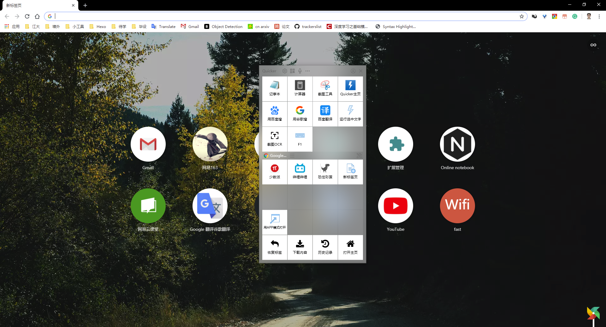
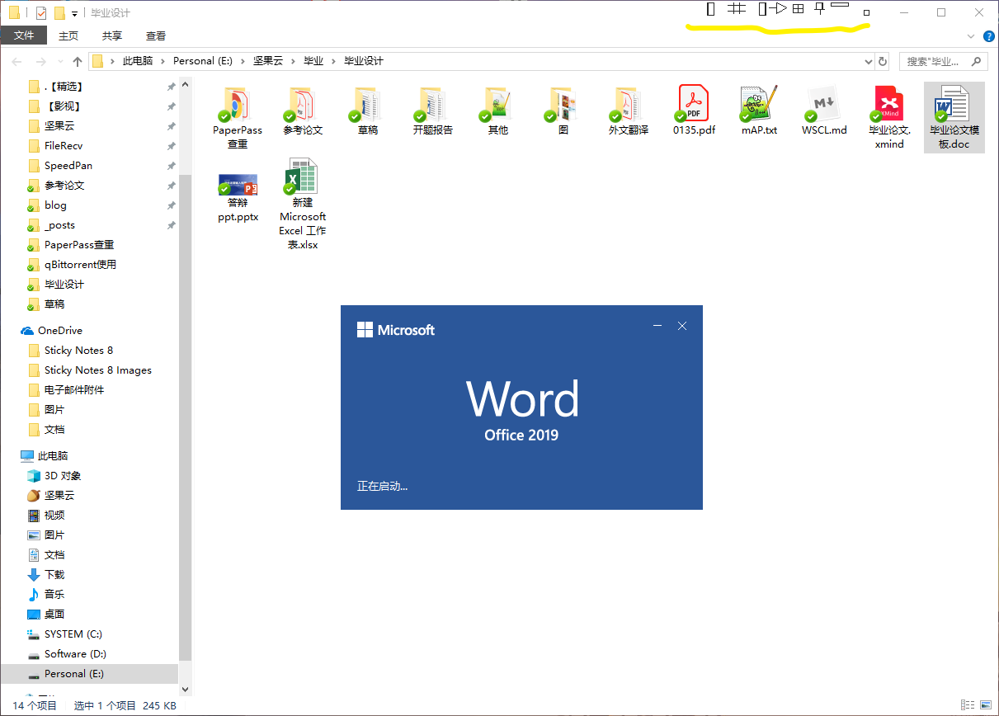

## 一些有趣且实用的Windows工具分享

> 君子性非异也，善假于物也。         - - 荀子《劝学》

首次提交：2019-05-17 by [🐲](https://github.com/Jngwl)

更新：2020-12-17 by [⚡](https://www.zhihu.com/people/shaoeric)

## 截图贴图工具Snipaste

- [官网链接](https://zh.snipaste.com/)    [官方文档](https://docs.snipaste.com/zh-cn/)

- 特色点
  - 强大的截图功能。
    - 可自动识别界面元素区域，使截图更便捷
    - 支持**多种形式的标注**、**取色**、**复制**等操作等
  - 极致的贴图功能。
    - 截图后，支持通过固定按钮（或`Ctrl+T`）将图像固定到桌面，并自动置顶
    - 贴图后，支持通过`空格键`对贴图进行**多次标注**
    - 可通过鼠标调节图片尺寸、透明度等
  - 便捷的快捷键，任何界面`F1`截图、`F3`贴图、`空格`二次编辑贴图

- 示例图片

## 快捷启动器Listary

- [官网链接](https://www.listary.com/)

- 特色点
  - 支持**本地文件快速搜索**（包含应用快速启动），比`Windows`自带的文件搜索快一万倍  
  - 可**自定义关键字**实现谷歌、必应、维基、百度等网站的快速搜索
  - 丰富的动作选项，如打开文件路径、复制、剪切、复制文件路径到剪贴板等
  - 便捷的快捷键，任何界面双击`Ctrl`即可激活
- 示例图片

## 常用操作库 Quicker

- [官网链接](https://getquicker.net/)
- 特色点
  - 支持**自定义各种快捷动作**（如截图OCR等），有丰富的动作库
  - 对不同的应用可创建不同的动作面板（如`Google Chrome`）
  - 通过`鼠标中间键`快速激活

- 示例图片

## 窗口管理器Сhameleon Window Manager

- [官网链接](http://www.chameleon-managers.com/window-manager/)
- 特色点
  - 支持**窗口置顶**，类似于`Ubuntu`
  - 支持窗口尺寸、位置、**透明度**等各种自定义设置
- 示例图片

## 其他

- 搜索：[虫部落](https://search.chongbuluo.com/)
- 电子书教材搜索：[鸠摩搜索](https://www.jiumodiary.com/)
- 杀毒软件：[火绒安全](https://www.huorong.cn/)
- 同步盘：[坚果云](https://www.jianguoyun.com/)
- 下载器：[IDM](https://www.internetdownloadmanager.com/)、[FDM](https://www.freedownloadmanager.org/zh/)、[qBittorent](https://www.jngwl.top/2019/05/10/qBittorrent%E4%BD%BF%E7%94%A8/)等
- 视频播放器：[potplayer](https://daumpotplayer.com/)
- 思维导图：[幕布](https://mubu.com/)、[XMind](https://www.xmind.cn/)
- 文件（夹）比较：[Beyond Compare](https://www.scootersoftware.com/)
- 复制粘贴工具：[teracopy](https://www.codesector.com/teracopy)
- 临时邮箱：[10分钟邮箱](http://mail.bccto.me/)
- 截图转换Latex：[Mathpix](https://mathpix.com/)
- 第三方百度云：[速盘](https://www.speedpan.com/)、[Pandownload](http://pandownload.com/)
- word代码高亮：[planetB](http://www.planetb.ca/syntax-highlight-word)
- 可定义dpi的截屏工具: [链接](https://pan.baidu.com/s/1M8QKMOxPq4hyczfDhO8spw)  提取码：gkkr 
- git图形化工具：[sourcetree](https://www.sourcetreeapp.com/)
- 各种谷歌插件

  - sourcegraph: github代码浏览
  - 简悦：网页文本渲染成杂志模式，去掉无效信息干扰
  - 
- ...s

