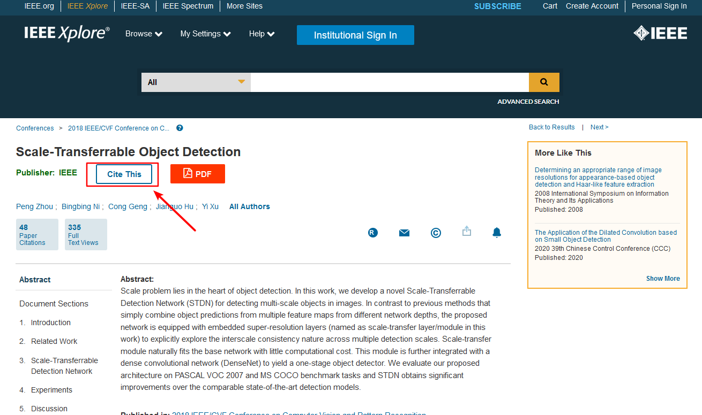
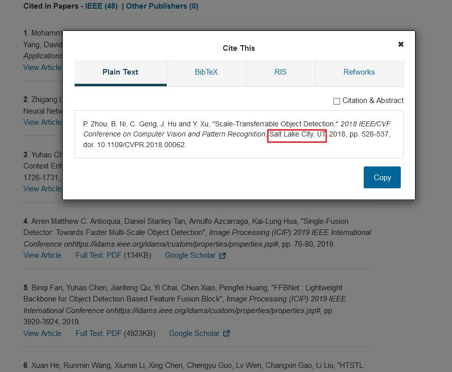
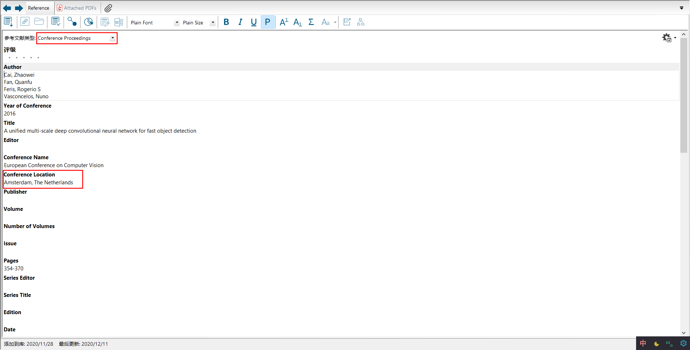

> 本文转载于本人的博客[🐧](https://qiyuan-z.github.io/)

## 前言

鉴于某些参考文献，在引用会议时需要注明开会地点，然而谷歌学术中并不能提供会议地点，这里提供一些常用会议地点的检索网址。

## 地点查询
历届NIPS会议地址：https://www.datalearner.com/conference/nips/
历届ECCV会议地址：https://link.springer.com/conference/eccv
历届BMVC会议地址：https://britishmachinevisionassociation.github.io/bmvc
历届IEEE下的会议地址（如CVPR，ICCV等）请到IEEE下搜论文导出参考文献可得：

这里也提供历届ECCV、ICCV、CVPR、WACV地址：https://www.thecvf.com/?page_id=100

## 引用

查询到地点后手动添加进EndNote题录的关键字即可：

