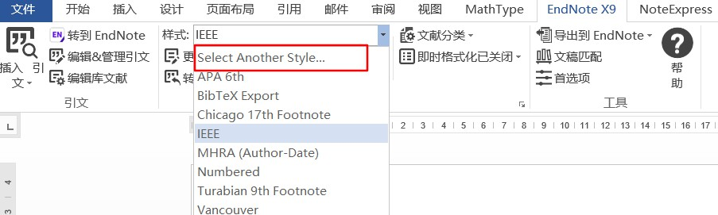
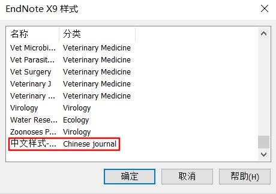
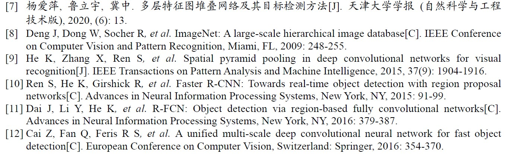
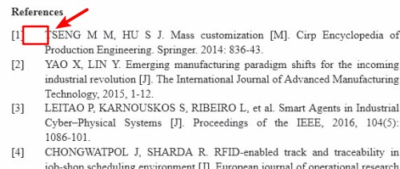
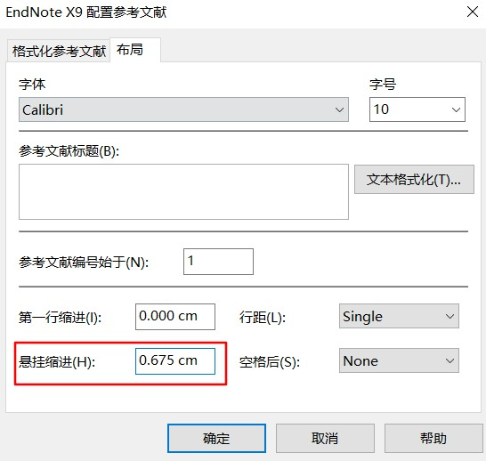
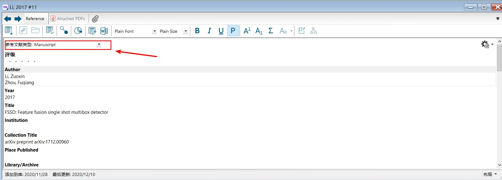
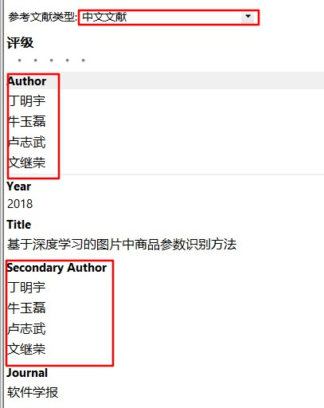

> 本文转载于本人的博客[🐧](https://qiyuan-z.github.io/)

## 前言

EndNote主要针对英文文献，所以并没提供符合中华标准的文献样式，而网上找的样式又不太对。因此这里本人根据中华人民共和国国家标准GB/T7714-2005和江南大学论文要求，制作了可供导入使用的样式。下载地址如下：[中文样式 by Qiyuan-Z](https://590m.com/file/17985533-475283286)

## 使用教程

**① 将.ens样式文件放入EndNote安装目录下的Styles文件夹。**

**② 使用时切换样式即可：**

**③ 插入文献效果如下：**

**④ 若参考文献序号后面空格过长可设置悬挂缩进距离：**

**⑤ arxiv等未出版期刊，请设置参考类型为Manuscript，以方便样式识别文献类型。**

**⑥ 由于EndNote并没提供中文文献的识别设置，为了解决问题，我们可以自定义中文文献类型：**

点击「编辑」→「首选项」→「参考文献类型」→「修改参考文献类型」（「Edit」→「Preference」→「Reference Types」→「Modify Reference Types 」）

EndNote未使用的文献类型 (Reference Type) 默认为3个 , 它们被命名为 Unused 1，Unused 2和Unused 3 。我们可以利用这几个未作用的文献类型来修改。

如选择Unused 1，在 Generic 项中输入新文献类型名「中文文献」，然后依次修改各项，修改完毕后「OK」关闭保存。

**⑦ 若为中文文献，请设置参考类型为中文文献，并填写Secondary Author（与Author一样），以方便样式识别文献类型。**

