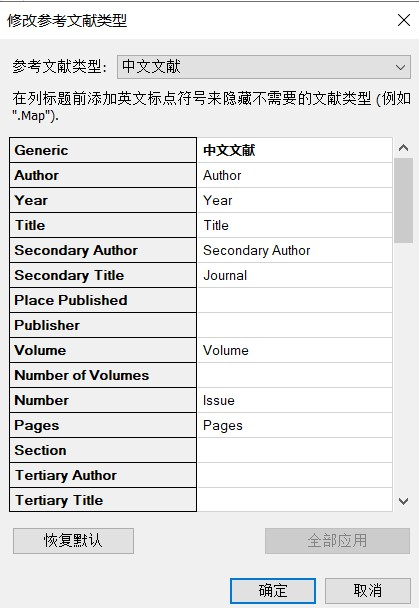

> 本文转载于本人的博客[🐧](https://qiyuan-z.github.io/)

## 前言

EndNote主要针对英文文献，所以并没提供符合中华标准的文献样式，而网上找的样式又不太对。因此这里本人根据中华人民共和国国家标准GB/T7714-2005和江南大学论文要求，制作了可供导入使用的样式。

下载链接如下：
[江大开题报告样式](https://drive.google.com/file/d/1RgwQu1P_yDF_zLhAr2b-q3qFkFm8pNLz/view?usp=sharing)
[江大毕业论文样式](https://drive.google.com/file/d/1FTBLvEhop5vU9oDvrPGh1XZMnOAR6Xtw/view?usp=sharing)

## 使用教程

**① 将.ens样式文件放入EndNote安装目录下的Styles文件夹。**

**② 使用时切换样式即可：**

**③ 插入文献效果如下：**

- 开题报告：

- 毕业论文：

  

**④ 若参考文献序号后面空格过长可设置悬挂缩进距离：**

## 注意事项

### ①  arxiv期刊，请设置参考类型为Manuscript，以方便样式识别文献类型，并按图中字段完善相应内容。

### ② 中文文献，请设置参考类型为中文文献，并填写Secondary Author（与Author一样），以方便样式识别文献类型。

**中文文献参考类型设置：**

点击「编辑」→「首选项」→「参考文献类型」→「修改参考文献类型」（「Edit」→「Preference」→「Reference Types」→「Modify Reference Types 」）

EndNote未使用的文献类型 (Reference Type) 默认为3个 , 它们被命名为 Unused 1，Unused 2和Unused 3 。我们可以利用这几个未作用的文献类型来修改。

如选择Unused 1，在 Generic 项中输入新文献类型名「中文文献」，然后依次修改各项，修改完毕后「OK」关闭保存。

### ③ 学位论文，则按照如下图，完善相应信息。

### ④ 会议论文请补充完善会议地点：

## 文献检索网站推荐

感谢黄姐👩提供的建议，这里放出一个比谷歌学术还要好用的[文献检索网站](https://dblp.uni-trier.de/)

相比于谷歌学术，它可以精确地查找到预印本是否已出版：

支持多种题录格式导出：

有详细的会议地点：

