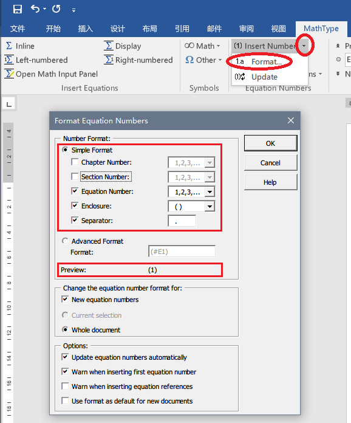
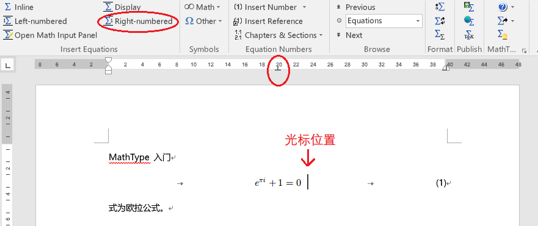
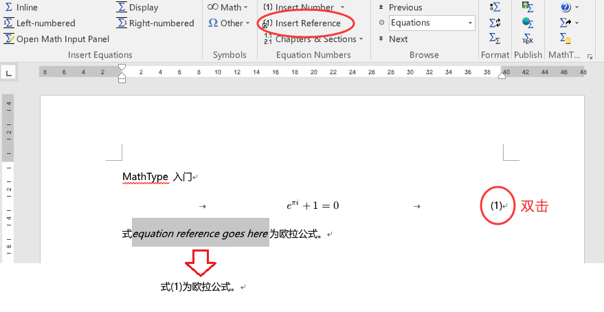
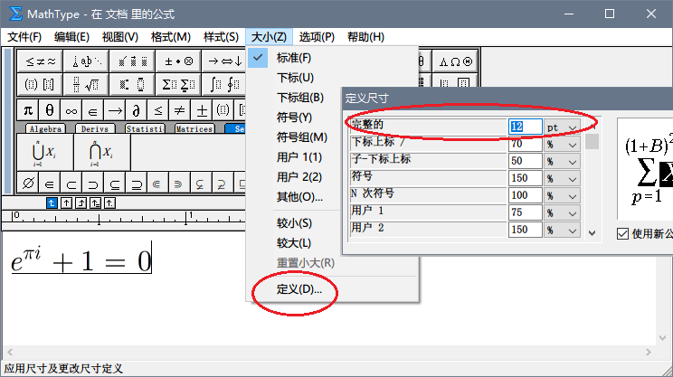

# MathType 入门

首次提交：2017-12-09 by [🐟](https://github.com/tyusr)

## 引言

如果使用 Word 来写作学术论文，那么 MathType 基本上肯定是要用到的了。废话不多说，来看一下写论文时，一般要如何使用 MathType。

## 设置序号

首先把公式序号的格式设置好。在 Word 中打开 MathType 标签页，点击 **Insert Number** 右边的小箭头 -> **Format**，在弹出的窗口中，可以设置公式的编号格式并预览。

## 插入公式

MathType 标签页中插入新公式有五个按钮，分别是：

* **Inline** 插入文中公式
* **Display** 插入单独成行的公式
* **Left-numbered** 插入单独成行的公式，编号在公式左边
* **Right-numbered** 插入单独成行的公式，编号在公式右边
* **Open Math Input Panel** 识别手写公式

绝大多数论文中的公式，编号都是在右边的，所以我们点 **Right-numbered** 插入一个公式。

把光标移动到公式所在的那一行，界面的标尺中将显示一个倒 T 形的标记，可以移动这个标记来移动公式的位置。

（如果没有标尺，可以在 Word 的**视图**标签页勾选标尺）

**由 MathType 自动生成的公式编号，是会随公式位置的变化而自动调整的**，十分方便。

## 引用公式

首先把光标移动到引用公式的位置，点击 **Insert Reference**，光标位置会多出一段字：equation reference goes here。

双击欲引用的公式编号，完成引用。之前多出来那段字会自动变成引用公式的编号。这些引用也是**随着公式编号的变化而自动调整**。

## 更新编号

如果出现了公式编号、引用编号不正确的情况，可以先点击 **Insert Number**右边的小三角->**Update**来更新编号，再排查其他错误。

## 注意字体大小

MathType 的公式是有字体大小的！这一点被很多新人忽视，以至于在需要调节公式大小的时候，直接在 Word 里去拖公式的那个框……不推荐这样做，因为无法精准地调整公式大小。

最好的做法是在 MathType 的公式界面，点击**大小**->**定义**，在弹出的设置框中调整公式的尺寸。

如上图所示。**pt** 指的是磅数。磅数和字号是有对应关系的，这里列一些常用字号对应的磅数：

字号|磅数
--- |---
二号|21
小二|18
三号|16
四号|14
小四|12
五号|10.5
小五|9
